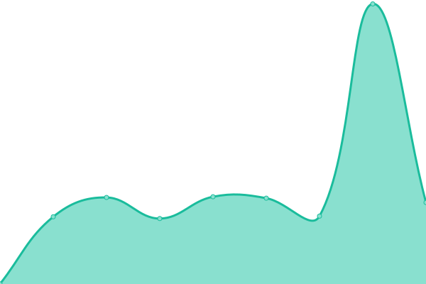
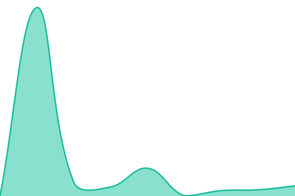
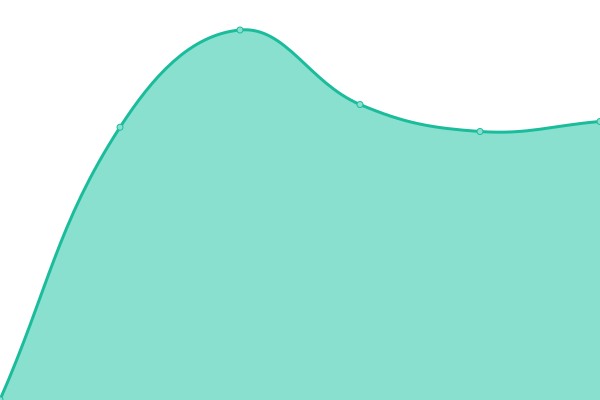

# [📈 Live Status](https://upptime.github.io/upptime): <!--live status--> **🟧 Partial outage**

This repository contains the open-source uptime monitor and status page for [Upptime](https://upptime.js.org), powered by [Upptime](https://github.com/upptime/upptime).

With [Upptime](https://upptime.js.org), you can get your own unlimited and free uptime monitor and status page, powered entirely by a GitHub repository. We use [Issues](https://github.com/upptime/upptime/issues) as incident reports, [Actions](https://github.com/memoemg/howyoudoing/actions) as uptime monitors, and [Pages](https://upptime.github.io/upptime) for the status page.

<!--start: status pages-->
<!-- This summary is generated by Upptime (https://github.com/upptime/upptime) -->
<!-- Do not edit this manually, your changes will be overwritten -->
<!-- prettier-ignore -->
| URL | Status | History | Response Time | Uptime |
| --- | ------ | ------- | ------------- | ------ |
|  [Kimuk](https://kimuk.conare.ac.cr/Search/Results?lookfor=&type=AllFields) | 🟥 Down | [kimuk.yml](https://github.com/memoemg/howyoudoing/commits/HEAD/history/kimuk.yml) | 

 8269ms
     
 | 

<a href="https://memoemg.github.io/howyoudoing/history/kimuk">84.35%</a>
    

|  [Kérwá](https://kerwa.ucr.ac.cr) | 🟩 Up | [kerwa.yml](https://github.com/memoemg/howyoudoing/commits/HEAD/history/kerwa.yml) | 

 1604ms
     
 | 

<a href="https://memoemg.github.io/howyoudoing/history/kerwa">98.63%</a>
    

|  [Portal de Revistas](https://revistas.ucr.ac.cr) | 🟩 Up | [portal-de-revistas.yml](https://github.com/memoemg/howyoudoing/commits/HEAD/history/portal-de-revistas.yml) | 

 1139ms
     
 | 

<a href="https://memoemg.github.io/howyoudoing/history/portal-de-revistas">100.00%</a>
    

|  [UCRIndex](https://ucrindex.ucr.ac.cr) | 🟩 Up | [ucr-index.yml](https://github.com/memoemg/howyoudoing/commits/HEAD/history/ucr-index.yml) | 

 2324ms
     
 | 

<a href="https://memoemg.github.io/howyoudoing/history/ucr-index">100.00%</a>
    

|  [Revistas UTN](https://revistas.utn.ac.cr) | 🟩 Up | [revistas-utn.yml](https://github.com/memoemg/howyoudoing/commits/HEAD/history/revistas-utn.yml) | 

 466ms
     
 | 

<a href="https://memoemg.github.io/howyoudoing/history/revistas-utn">100.00%</a>
    

<!--end: status pages-->

[**Visit our status website →**](https://upptime.github.io/upptime)

## 📄 License

- Powered by: [Upptime](https://github.com/upptime/upptime)
- Code: [MIT](./LICENSE) © [Upptime](https://upptime.js.org)
- Data in the `./history` directory: [Open Database License](https://opendatacommons.org/licenses/odbl/1-0/)
